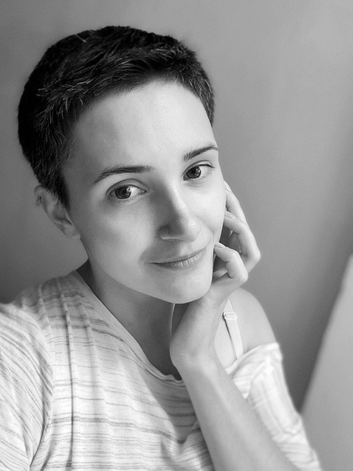

## Анастасия Беспалова
# software engineer in test

### Profile
____________________________________________________________________
5 лет опыта в обеспечении качества в роли Manual QA и Тест Аналитика. Активно развиваюсь в области автоматизированного тестирования - прохожу курсы Java Automation Engineer.

### Employment History
____________________________________________________________________
**QA Engineer, Self-emploed**                         Россия, Москва

2017 — по настоящее время

Тест Аналитик - разработка тестовой документации для передачи в автоматизацию тестирования.
* Провела исследование и анализ продукта в условиях неактуальной документации
* Составила актуальную карту продукта
* Составила Smoke и Regression тестовые наборы
* Разработала, согласовала и передала в автоматизацию свыше 100 кейсов на английском языке.

Тестировщик - тестирование финтех проекта для иностранного заказчика (web, UI, API, Регресс):
* Построила процесс тестирования в Agile команде с 0.
* Разработала тестовую и проектную документацию, как внешнюю на английском так и внутреннюю.
* Помогла команде придти к уровню качества релизов удовлетворяющему потребности заказчика и менеджмента команды.

Тестирование крупного сервиса недвижимости
* Включилась в работу большой команды тестирования
* Участвовала в ежедневных релизах
* Разработала тестовую документацию на ввереный участок проекта

**QA Engineer**                [Rambler&Co](rambler.ru/) Россия, Москва

2016 — 2017         

Находясь на должности QA проводила:
- Функциональное
- Регрессионное
- Usability
- Тестирование верстки/UI, кроссбраузерное тестирование;
Тестировала:
- web-приложения
- мобильные версии web-приложений
- мобильные приложения;
- 
Участвовала в бэклог-грумингах и планировании;

Разрабатывала тестовую документацию;

Проводила локализацию ошибок на основе обратной связи от пользователей;
* Выстроила процесс тестирования в Agile команде.
* Участвовала в роли единственного qa в нескольких спецпроектах от Газета.ру в условиях жестких дедлайнов.
* Вела внешние проекты группы компаний в качестве Тест-менеджера и Тест-аналитика.

**QA Engineer**                [Ай-Теко(I-Teco)](www.i-teco.ru) Россия, Москва

2015 — 2016

Работала над Web проектами для Почты России и Сбербанк

Проводила следующие виды тестирования:
- Функциональное
- Регрессионное
- Исследовательское
- Usability
- Тестирование верстки/UI, кроссбраузерное тестирование;
- Тестирование проектной документации;

Создавала отчеты об ошибках, контролировала их исправление;

Разрабатывала тестовую и проектную документацию (стратегия тестирования, план тестирования, программа и методика испытаний, тест-кейсы, чек-листы);

Разрабатывала пользовательскую документацию (руководство пользователя);

Работа по RUP.

**QA Engineer**          [Центр развития экономики, ОАО](www.b2b-center.ru/) Россия, Москва  

2013 — 2015                     

Находясь на должности проводила:
- Функциональное
- Регрессионное
- Usability
- Тестирование верстки/UI, кроссбраузерное тестирование;

Локализировала ошибки на основе обратной связи от пользователей;

Запускала автотесты и анализировала результаты запуска

Участвовала в бэклог-грумингах и планировании;

Разрабатывала требования на функционал;

Занималась постановкой и контролем выполнения задач для разработчиков;

Выступала в качестве QA на следующих проектах:
* Электронный документооборот - проект разработан с нуля и успешно выпущен.
* Мобильное приложение для iphone - проект разработан с нуля и успешно выпущен. На проекте я выполняла роль тестировщика(приёмочное тестирование) и системного аналитика.
* Электронная банковская гарантия - проект разработан с нуля и успешно выпущен.
* Годовая Комплексная Программа Закупок - полное исследовательское и регрессионное тестирование проекта после рефакторинга в условиях полного отсутствия документации. Проект успешно выпущен в продакшен.
* Формирование счетов и договоров - поддержание и доработка проекта.
* Обратная связь с операторами - поддержание и доработка проекта.
* Личный кабинет оператора - поддержание и доработка проекта.
* Личный кабинет пользователя - поддержание и доработка проекта.
* Электронно цифровая подпись - поддержание и доработка проекта.

### Education
____________________________________________________________________
2011 **Российский университет кооперации, Москва**  Охотоведение, охотовед

Курсы:

2016 **Тестирование методом свободного поиска (exploratory testing)** Лаборатория Качества, Тестирование ПО

2014 **Планирование тестирования и проектирование тестов** Лаборатория Качества, Тестирование ПО
